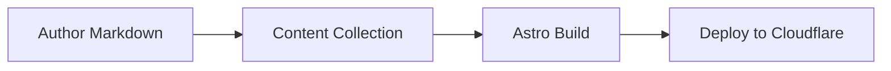
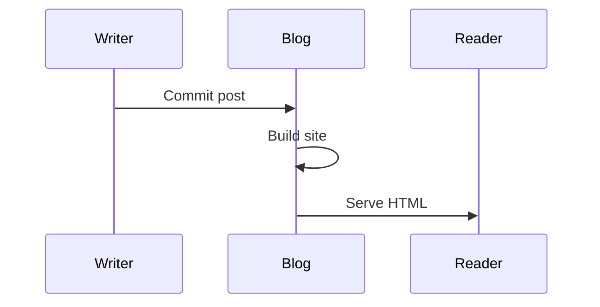

This post is a practical walkthrough of the authoring toolkit in this blog. It is intentionally dense so you can see how the system behaves with real-world technical writing, not just a toy example. You will find code blocks (with copy), Mermaid diagrams, images with captions and lightbox behavior, GitHub-flavored Markdown, callouts, and a few extras like footnotes. If anything looks off, this is the best place to spot it before you start publishing.

Inline code should read cleanly, like `POSTS_PER_PAGE` and `import.meta.env.DEV`, without overpowering the paragraph. Links should be readable and consistent with the surrounding text.

## Overview and goals

The goal is a writing system that does not get in the way. That means:

- The Markdown authoring surface stays simple.
- Rich formatting is opt-in but discoverable.
- Code and diagrams look sharp and copy well.
- Images are intentional and consistent.

Below is a friendly checklist to keep the authoring experience honest.

- [x] Code blocks with copy button
- [x] Mermaid diagrams
- [x] Image figure + caption support
- [x] Lightbox zoom for screenshots
- [x] Callouts and alerts
- [x] GFM tables, tasks, and ~~strikethrough~~

> A good rule: if a feature is hard to remember or write, it should probably be removed.

## Code blocks and frames

Here is a short TypeScript example with a file title. It should render in a frame (if supported) and include a copy button.

```ts title="src/lib/pagination.ts"
export type Page<T> = {
  data: T[];
  currentPage: number;
  lastPage: number;
};

export const paginate = <T>(items: T[], pageSize: number, page: number): Page<T> => {
  const total = Math.max(1, Math.ceil(items.length / pageSize));
  const currentPage = Math.min(Math.max(page, 1), total);
  const start = (currentPage - 1) * pageSize;
  return {
    data: items.slice(start, start + pageSize),
    currentPage,
    lastPage: total,
  };
};
```

Now a longer, more realistic code block (50+ lines) with comments. This helps test scrolling, readability, and the copy UX.

```ts title="src/content/load-posts.ts"
type Frontmatter = {
  title: string;
  description: string;
  pubDate: Date;
  updatedDate?: Date;
  tags: string[];
  draft?: boolean;
  heroImage?: string;
};

type Post = {
  slug: string;
  data: Frontmatter;
  body: string;
};

const isDraft = (post: Post, includeDrafts: boolean): boolean => {
  if (includeDrafts) return false;
  return Boolean(post.data.draft);
};

export const sortNewest = (a: Post, b: Post): number =>
  b.data.pubDate.valueOf() - a.data.pubDate.valueOf();

export const loadPosts = (posts: Post[], includeDrafts: boolean) => {
  const visible = posts.filter((post) => !isDraft(post, includeDrafts));

  // Normalize tag casing for URL routes but keep the original label
  const tagMap = new Map<string, { label: string; count: number }>();
  for (const post of visible) {
    for (const tag of post.data.tags ?? []) {
      const slug = tag.trim().toLowerCase().replace(/\s+/g, "-");
      const entry = tagMap.get(slug);
      if (entry) {
        entry.count += 1;
      } else {
        tagMap.set(slug, { label: tag, count: 1 });
      }
    }
  }

  // Sort posts by date and return a snapshot
  return {
    posts: visible.sort(sortNewest),
    tags: Array.from(tagMap.entries()).sort((a, b) =>
      a[1].label.localeCompare(b[1].label)
    ),
  };
};
```

Here are a few other language blocks to validate syntax highlighting:

```csharp title="src/App/Services/FeedBuilder.cs"
public sealed class FeedBuilder
{
    public string BuildTitle(string siteName, string tagline)
    {
        return $"{siteName} — {tagline}";
    }
}
```

```sql title="db/migrations/2026-01-14-add-posts.sql"
CREATE TABLE posts (
  id UUID PRIMARY KEY,
  slug TEXT NOT NULL UNIQUE,
  title TEXT NOT NULL,
  description TEXT NOT NULL,
  pub_date DATE NOT NULL,
  updated_date DATE,
  tags TEXT[] DEFAULT '{}'
);
```

```bash title="Terminal" frame="terminal"
node --version
npm run dev
```

```json title="content/collection.json"
{
  "title": "Computed Cloud",
  "description": "A compact blog for technical writing.",
  "rss": "/rss.xml",
  "postsPerPage": 10
}
```

```diff title="docs/changes.diff"
--- before.md
+++ after.md
@@ -1,4 +1,6 @@
-# Hello
-This is a draft.
+# Hello
+This is a draft with a note.
+
+> [!NOTE]
+> Drafts stay private in production.
```

## Mermaid diagrams

Mermaid blocks are great for architecture sketches or flows. Here is a simple flowchart:



And a sequence diagram showing a tiny workflow:



## Images, captions, and lightbox

The hero image should render as the header and also work inside the post.


Here is a fake UI screenshot. Click to zoom and confirm the lightbox behavior.


And a small diagram-like image. It should still get a caption and consistent styling.


## Callouts and notes

Use callouts to highlight important context without interrupting the flow.

> [!NOTE]
> Notes are best for clarifying context or assumptions.

> [!TIP]
> Tips are perfect for small shortcuts or better defaults.

> [!WARNING]
> Warnings should be rare, but very visible.

> [!IMPORTANT]
> Use important blocks to highlight a decision that has consequences.

> [!CAUTION]
> Caution blocks are ideal for irreversible actions.

## GFM features

Below is a comparison table. It should render with clean borders and readable spacing.

| Capability | Markdown Syntax | Output |
| --- | --- | --- |
| Code blocks | ```ts | Highlighted with copy |
| Mermaid | ```mermaid | Diagrams |
| Callouts | > [!NOTE] | Styled alerts |
| Tables | Pipes | Structured data |
| Tasks | - [x] | Checklists |

Task lists should render as checkboxes:

- [x] Outline the post
- [x] Add diagrams
- [x] Insert images
- [ ] Publish

Strikethrough should work for edits and revisions: ~~temporary note~~.

## Longer narrative example

This section simulates a normal, longer-form post that mixes headings, lists, and commentary.

### A working checklist

Before you publish, run through a small checklist:

1. Confirm the title and description are accurate.
2. Ensure dates are correct and drafts are false.
3. Verify all images resolve under `public/assets/`.
4. Make sure Mermaid diagrams render.
5. Confirm the RSS feed includes the post.

### Practical guidelines

Here are a few writing guidelines that keep posts readable:

- Short paragraphs are easier to scan.
- Use lists sparingly but intentionally.
- Give code blocks meaningful context.
- Keep headings descriptive, not cute.

#### A quick aside

Blockquotes should render with a subtle border and distinct typography. This keeps long quotes easy to spot.

> “Good documentation is like a map: simple, clear, and reliable.”

---

## Wrap-up checklist

If all of the above renders correctly, authoring should be in great shape for real content.

- [x] Code blocks with frames and copy
- [x] Mermaid flowchart and sequence diagram
- [x] Images with captions and lightbox
- [x] Callouts (five types)
- [x] Tables, task lists, and strikethrough

Footnotes should also work if supported.[^1]

[^1]: This is a footnote example. If it renders cleanly, you are good to go.
