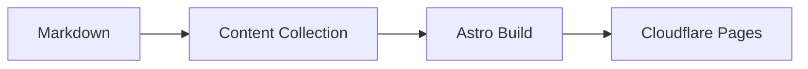

This post exercises the authoring toolkit before real content lands.

## Highlighted code

```ts title="src/utils/math.ts"
export const sum = (values: number[]) => values.reduce((a, b) => a + b, 0);

export const average = (values: number[]) =>
  values.length === 0 ? 0 : sum(values) / values.length;
```

```bash title="Terminal" frame="terminal"
pnpm run build
pnpm run preview
```

## Mermaid diagram



## Screenshot with caption


> [!TIP]
> Short callouts work well for quick guidance.

:::note
This is a directive-style callout for longer explanations.
:::

## GitHub-flavored Markdown

- [x] Write the post
- [ ] Add screenshots
- [ ] Publish

| Tool | Purpose |
| --- | --- |
| Expressive Code | Code blocks with copy |
| Mermaid | Diagrams |
| Remark GFM | Tables and task lists |
