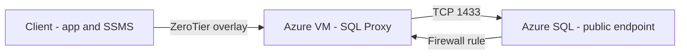

### TL;DR

* **Constraint:** Azure SQL firewall rules want a stable source IP. Home internet (and failover links) don't provide that.
* **Decision:** Put a small Azure VM on a static public IP, join it to **ZeroTier**, and run **HAProxy** as a TCP proxy for SQL.
* **Outcome:** Clients connect to the proxy over ZeroTier, but Azure SQL only sees the VM's public IP (the one allowed by the firewall rule).
* **Scar:** Using a custom hostname caused `Target principal name is incorrect` due to TLS name mismatch. I chose `Trust Server Certificate` on purpose, with a clear tradeoff.

---

## Context and constraints

I wanted "compute can run anywhere" without turning database access into a whack-a-mole firewall problem.

The database is Azure SQL (public endpoint for now). Azure SQL's firewall wants predictable source IPs. My local environment does not have that, and it gets worse once you add backup internet.

Private Endpoint would have been fine, but it wasn't necessary for the goal I had. I kept the public endpoint and relied on Azure SQL firewall rules.

> **Rule of thumb:** Move "egress identity" to a place you control. Don't try to make home internet behave like a datacenter.

---

## The goal

* Clients (apps, admin tools) can connect from anywhere.
* Database sees one stable source IP.
* Routing and access are explicit and easy to reason about.
* Minimal Azure spend.

---

## Architecture



 -> Azure SQL, with the firewall allowing only the VM's public IP.")

Key idea: clients never connect to Azure SQL directly. They connect to the proxy over ZeroTier. Azure SQL only ever sees the proxy VM's public IP.

---

## Step 1: Create the Azure VM and pin a static public IP

This VM is a "utility box":

* ZeroTier client
* HAProxy
* Nothing else

Sizing: for overlay + TCP proxy, a small Linux VM is usually enough (1 vCPU / 1 GB RAM is a common baseline). Disk and bandwidth matter more than CPU.


### Static IP

Attach a **static public IP** to the VM NIC. If you already reserved an IP prefix/range, you can pick one IP from that block and use it as the database egress identity.

.")

---

## Step 2: Put the VM on ZeroTier

Create (or reuse) a ZeroTier network dedicated to production database access. Keep it separate from day-to-day workstation networks.

* Join the Azure VM to the network
* Authorize it in ZeroTier Central
* Confirm it gets a stable ZeroTier IP


> **Rule of thumb:** If you're serious about separation, don't put your workstation in the production network. Use an ops/admin network plus a jump host when you need access.

---

## Step 3: Don't expose the proxy publicly

There are two different "paths" to think about:

* **Underlay (Azure NIC / public IP):** how the VM talks to the internet so ZeroTier can form tunnels.
* **Overlay (ZeroTier):** the traffic you actually care about (clients → proxy).

For the SQL proxy port, the main point is: clients should reach it over ZeroTier, not over the VM's public IP.

I handled that by binding HAProxy to the VM's **ZeroTier IP** (not `0.0.0.0`). Once you do that, there's no public listener on TCP 1433, and the "should I add an NSG rule?" question mostly goes away.

If your environment blocks outbound by default, make sure the VM can reach ZeroTier (UDP 9993 outbound). If you already allow outbound, you may not need to touch NSGs for this approach at all.

---

## Step 4: Install and configure HAProxy as a TCP proxy

This is a pass-through TCP proxy. HAProxy does not need to understand SQL. It forwards bytes.

### Install (Ubuntu/Debian)

```bash
sudo apt-get update
sudo apt-get install -y haproxy
```

### Configure `/etc/haproxy/haproxy.cfg`

Add a dedicated TCP frontend/backend. I recommend binding to the ZeroTier IP so port 1433 is not reachable on the public interface:

```cfg
frontend sql_in
    bind <proxy_zerotier_ip>:1433
    mode tcp
    option tcplog
    default_backend sql_out

backend sql_out
    mode tcp
    option tcplog
    server azuresql your-sql-server-name.database.windows.net:1433
```

Validate and restart:

```bash
sudo haproxy -c -f /etc/haproxy/haproxy.cfg
sudo systemctl enable haproxy
sudo systemctl restart haproxy
sudo systemctl status haproxy --no-pager
```

.")

### Why the backend is `*.database.windows.net` (and not an IP)

ZeroTier can do "route this destination through that exit node" patterns. That works best when the destination is a stable IP.

Azure SQL isn't a single database server with a single address. You connect to a DNS name, land on a gateway, and the gateway redirects you to the right place. The IPs involved can vary over time and even between connections.

I've seen Azure SQL described as running on Service Fabric historically, but I'm not sure what the current internal platform is. The gateway + redirection behavior is the part that matters.

That's why HAProxy is doing two jobs:

* Accept a connection over ZeroTier.
* Initiate a new outbound connection using the Azure SQL **DNS name**, so the gateway logic keeps working.

### One HAProxy gotcha: `option httplog`

If your global HAProxy defaults include:

```cfg
defaults
    option httplog
```

HAProxy will complain for TCP frontends:

> `'option httplog' not usable with frontend 'sql_in' (needs 'mode http'). Falling back to 'option tcplog'.`

It's not fatal. It's telling you your logging mode doesn't match. Fix it by adding `option tcplog` in the TCP frontend/backend (as shown above), or by splitting your defaults if you also run HTTP frontends.

> **Failure mode:** HTTP logging configured globally caused warnings for a TCP SQL frontend.
> **Change:** Configure `option tcplog` explicitly for the TCP proxy blocks.
> **New rule:** If HAProxy is doing both HTTP and raw TCP, set logging per-frontend instead of relying on one global default.

---

## Azure SQL redirect mode (why the proxy broke)

Azure SQL has two connection policies: **Redirect** and **Proxy**. Many setups default to Redirect.

* **Redirect:** client connects to the gateway on 1433, then is redirected to a specific database node IP/port.
* **Proxy:** client stays on the gateway path for the whole session.

This matters if your client connects to Azure SQL through a TCP proxy using a custom hostname.

In this setup, the first connection goes through HAProxy (`sql-proxy-prod.internal` → HAProxy → `*.database.windows.net:1433`). Then Redirect kicks in. The SQL client opens a second connection to the node IP/port, and that second connection bypasses HAProxy. From a workstation, it fails (not allowlisted / routing mismatch).

HAProxy can't rewrite that redirect. It's a TCP pass-through. The redirect is driven by the SQL protocol and client behavior.


Fix: set the Azure SQL **server connection policy** to **Proxy** (often shown as `Azure SQL Server > Networking > Connection policy: Proxy`) so the client does not attempt the redirected direct-to-node connection.

Tradeoff: Proxy has higher latency and lower throughput than Redirect. It's acceptable for now, and I'll revisit it when I move to Private Endpoint.

> **Failure mode:** Redirect bypassed the proxy.
> **Change made:** Set Azure SQL server connection policy to Proxy.
> **New rule of thumb:** If you proxy Azure SQL over TCP, force Proxy mode (or use Private Endpoint).

---

## Step 5: Add an Azure SQL firewall rule for the proxy VM

In Azure SQL Server networking/firewall settings:

* Add a firewall rule that allows the proxy VM's **static public IP** (or your full IP prefix range, if you manage access by ranges)
* Keep "Allow Azure services and resources…" off unless you explicitly want that broader scope


At this point, the "firewall blocked" error should stop. If it doesn't, you're either not reaching the proxy VM, or the proxy is not the real egress path.

---

## Step 6: Client configuration with a custom hostname

I wanted **clear separation** between:

* the real Azure SQL hostname (`*.database.windows.net`)
* the proxy endpoint I created

So I used a custom hostname that resolves to the proxy VM's **ZeroTier IP**.

Example:

* `sql-proxy-prod.internal` → `10.147.0.10` (proxy VM ZeroTier IP)


### SSMS settings

When connecting in SSMS:

* Server name: `sql-proxy-prod.internal,1433`
* Connection Properties:

  * Encrypt connection: enabled
  * **Trust server certificate:** enabled


### Application connection string

Example (SQL auth):

```txt
Server=sql-proxy-prod.internal,1433;
Database=YourDb;
User ID=YourUser;
Password=YourPassword;
Encrypt=True;
TrustServerCertificate=True;
```

> **Tradeoff:** `TrustServerCertificate=True` disables hostname validation. Encryption still happens, but the client no longer verifies that the certificate matches the hostname you typed. This increases MITM risk if your overlay/DNS path is compromised.

---

## Validating the path from Windows

`nc` isn't built into Windows PowerShell. Use `Test-NetConnection`.

### 1) Confirm the port is reachable

```powershell
Test-NetConnection -ComputerName sql-proxy-prod.internal -Port 1433
```

You want:

* `TcpTestSucceeded : True`


If this fails, fix networking before you touch SQL logins.

If you see an initial connection succeed and then a second outbound connection attempt (often to an Azure IP on a high port), you're in **Redirect** mode and the redirected connection is bypassing your proxy.

### 2) Confirm HAProxy is listening (on the VM)

```bash
sudo ss -lntp | grep 1433
sudo journalctl -u haproxy -n 100 --no-pager
```

### 3) Confirm Azure SQL sees traffic from the proxy IP

Once you attempt a login, Azure SQL diagnostics/logs should show failed logins. The source IP should match the proxy VM's public IP (the one allowed by the firewall rule).


---

## What broke (the scars)

### Scar 1: Firewall error went away… then TLS failed

First symptom: firewall block errors. After allowing the proxy IP in the Azure SQL firewall rules, those stopped.

Next symptom: SSMS reported:

* `The target principal name is incorrect.`

That was a TLS name mismatch:

* I connected to `sql-proxy-prod.internal`
* Azure SQL presented a cert for `*.database.windows.net`

Since I chose not to override the Azure SQL hostname, I fixed this by enabling `Trust server certificate`.

This redirect issue only showed up after firewall and TLS were fixed, because the first failure masked the second connection attempt.

> **Failure mode:** Custom hostname + TLS pass-through caused certificate name mismatch.
> **Change:** I enabled `Trust server certificate` for the proxy endpoint.      
> **New rule:** A SQL proxy forces a TLS naming decision: DNS override, TLS termination, or trust the cert.

### Scar 2: HAProxy logging warning (`httplog` vs `tcplog`)

This came from mixing HTTP defaults with a TCP proxy. It wasn't fatal, but it's noise I don't want during an incident.

I fixed it by setting `option tcplog` on the TCP blocks.

---

## Tradeoffs and alternatives

### Why I didn't use Private Endpoint yet

Private Endpoint is a solid approach when you want to remove the public endpoint entirely and treat the database as "VNet-only."

I wasn't optimizing for that yet. My constraint was being able to write stable firewall rules, and Azure SQL firewall rules were enough once the egress IP was anchored in Azure. I'll likely move to Private Endpoint later if I tighten the threat model.

### Why I didn't override `*.database.windows.net`

It works, but it creates hidden coupling:

* The "real Azure SQL hostname" is now lying (it points to the proxy).
* Later, someone troubleshooting might assume direct connectivity when it's not.

I preferred a custom hostname and an explicit setting (`TrustServerCertificate=True`) so the intent is visible in the config.

### Latency

This path adds a hop:

client → overlay → Azure VM → Azure SQL

If your app is chatty (lots of small queries), you'll feel it. The fix is usually application behavior (batching, fewer round trips) or moving compute closer to the database.

> **Rule of thumb:** If latency surprises you, profile the query pattern before you redesign the network.

### Single point of failure

One proxy VM is one dependency. That may be fine. If it becomes critical, add a second proxy VM and treat "which proxy do I use?" as a deliberate availability decision.

---

## Checklist

* [ ] Create a small Azure Linux VM
* [ ] Attach a static public IP (or a reserved IP from a prefix)
* [ ] Confirm the VM can reach ZeroTier (UDP 9993 outbound)
* [ ] Bind HAProxy to the VM's ZeroTier IP (avoid a public TCP 1433 listener)
* [ ] Join the VM to the ZeroTier prod network and authorize it
* [ ] Install HAProxy and configure a TCP proxy for Azure SQL on port 1433      
* [ ] Add a firewall rule for the VM public IP (or prefix) in Azure SQL
* [ ] Set Azure SQL server connection policy to Proxy (until Private Endpoint)
* [ ] Create a custom hostname pointing to the VM's ZeroTier IP
* [ ] Clients connect with `Encrypt=True;TrustServerCertificate=True`
* [ ] Validate from Windows using `Test-NetConnection`
* [ ] Confirm Azure SQL logs show the source IP as the proxy VM's public IP     

---

## Wrap-up

The constraint was being able to write stable firewall rules, so I anchored database egress in Azure.

A small VM plus ZeroTier plus a TCP proxy got me:

* stable source IP at the database
* location-independent clients
* explicit environment separation (no "workstation accidentally equals prod")

If you only remember one thing: **a SQL proxy forces a TLS naming choice.** Decide whether you want DNS override, TLS termination, or trusting the certificate, and document it so future-you doesn't have to rediscover it.
