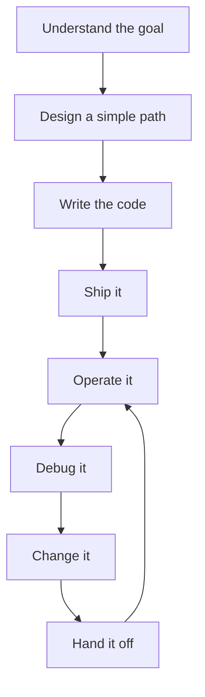

# Software that survives reality

I mean software that still works after the easy part is over.

A lot of people hear that and ask if it works in production. That is the floor, not the goal.

I care about whether the thing still makes sense when a vendor changes something, when a workflow fails in one odd corner, or when somebody else has to debug it six months later. That includes the people who run it, support it, and inherit it. It also includes the cost of operating it. Writing the code is only one part of the job.

---

## What falls apart

The worst version is software that needs constant tinkering just to stay alive. When something breaks, nobody can tell where. The logs are thin, the traces are missing, and every fix starts with a manual reconstruction.

That becomes the normal way of working:

- find the user
- recreate their setup
- trace through code by hand
- repeat

When that happens all the time, people start dreading the system.

---

## What holds up

Software that survives reality is not bug-free. Bugs happen.

The difference is that when a bug happens, you can find it without a scavenger hunt. Other engineers can change things without bracing for fallout. Operations is still work, but it is not a fight.

---

## What I care about

Most of the work is not writing code. The loop looks more like this:

If the original authors have to stay around forever for the system to make sense, it is fragile. That is the thing I am trying to avoid.

---

## My default principles

### Build it right when you already know the right way

This is not the same thing as pretending you have perfect requirements. Most of the time, you do not.

But there are plenty of times when people take a shortcut after they already know the right shape.

A simple example is hard-coding configuration into an application.

At first glance, it seems fine:

- set the value
- deploy
- it works

But now you have lost maintainability from the outside. If a URL changes because you need a different endpoint, a developer has to modify code, run a build, deploy, and take on the risk of unrelated changes just to change a configuration value.

That is a bad trade if you already knew better.

The principle is simple: make the right thing the easy thing for future-you and future engineers.

### Do not open the editor first

Even for a small project, I want a clear enough picture of what I am building.

Requirements can be vague. That is normal. But you still need a mental model:

- what does the user want to accomplish
- what are the workflows
- what does done mean for them
- what is the failure mode

Understanding the purpose before you touch the keyboard is one of the best uses of time.

### Pragmatism wins, but laziness loses

People use "keep it simple" or "don't repeat yourself" or a dozen other labels. For me it is simpler than that: pragmatism wins.

Pragmatism means accepting the state of the world and the fact that some things are outside your control.

Sometimes "do it right" and "be pragmatic" are in tension. That is real. You balance it:

- if the app is on fire, fix what is broken now
- then come back and fix it properly

The point is that pragmatism does not mean shipping garbage. It means being honest about what matters right now and what can wait.

Pragmatism is also how you avoid getting lost in the weeds. Bike shedding is real. People can argue endlessly about the color of the bike shed while the building is on fire.

Example: sending emails. There are multiple ways to do it. SMTP, vendor API, library. If email is not your core product, pick the safest option that gets the job done and move on.

### Keep the stack boring until you have a reason not to

This is the one that gets me into arguments.

If you understand the full system - where it runs, how it fails, what it costs - you usually do not need the complexity people assume is required.

Kubernetes is a good example. It has real benefits. Do you need it?

Usually not.

A single machine can do a lot. A handful of machines can give you redundancy. People often avoid simple deployments because they are afraid they cannot scale, but most systems never earn the right to that complexity.

Complexity has a real cost:

- in code
- in deployment
- in debugging
- in staffing
- in operations

The moment you start piling on microservices, multiple languages, and network boundaries as your primary isolation mechanism, you introduce costs that do not show up immediately. They show up later. And they stack up fast.

My bias is that simpler systems are cheaper to build, cheaper to run, and easier to understand.

---

## After the incident

Two of the hardest things I have learned, and had to build discipline around, are:

1. being pragmatic when it is not fun
2. not rushing when you should slow down and do it right

In an emergency, it is easy to focus. Fix the incident. Restore service. Get it stable.

The hard part is that when the emergency ends, the desire to go back and fix things properly disappears.

When you do have time, the temptation flips. You start embellishing. You start adding more because it might help someday. You start building a mountain of abstractions because it feels clever.

That is where I butt heads with people.

Abstractions are good right up until they are not. Complexity is only worth paying for when the benefit is real - maybe to users, maybe to resilience, maybe to observability - not because it is fashionable or how everyone does it.

Everyone is not us.

---

## Anti-patterns I avoid (or try hard to)

### Microservices for the sake of microservices

I have experimented with microservices. I can see the benefits.

But unless your organization actually splits along service boundaries - separate teams, separate ownership, separate release trains - microservices can be dangerous.

You become constrained by network speed. You are now doing:

- HTTP conversions
- routing
- service discovery
- retries and timeouts
- versioning API contracts
- distributed tracing, if you are lucky

That is a lot of new failure modes just to get, what, exactly?

People talk about scaling one piece of the application independently. That is real. But microservices do not magically solve statelessness, performance, or operational discipline. More often than not, I have seen them make a system worse than a simpler architecture would have been.

### Big bang rewrites

I hate rewriting software.

Big bang rewrites are dangerous because:

- behavior changes subtly
- customers notice the small details
- you never perfectly recreate all workflows
- the best outcome is "it works exactly as well as before," which is nearly impossible

I also have a strong bias that production rollouts should be backwards compatible, especially with the database. Version 1 of the app should continue to work against version 2 of the database, at least for some window. That pushes you toward incremental change instead of rewrites.

I am not pretending rewrites are never justified. Sometimes the technology is too old to maintain. Sometimes the system is fundamentally flawed.

"We want to rewrite it" is not a reason. It is a wish.

You need to know what you are trying to achieve and why that cannot be achieved incrementally.

---

## A few things that taught me this

### A small issue that was not small

We had a user who could not save product/invoice information. It looked isolated. One user. No big deal.

It was not.

As we dug in, it turned out to be an operational issue with the underlying tech, Blazor in this case. Worse, it was silently corrupting data. This one user's corruption triggered an exception that surfaced to us. Other cases were quiet.

We missed it in testing. It went to production. It created silent damage.

That is reality. Production does not just fail loudly. Sometimes it fails quietly and you do not know until it hurts.

### A system that worked until integrations were added

ERP integrations taught me a lesson I have learned more than once:

**your test environment is a lie.**

One example: an ERP integration with Viewpoint Vista. We had a test instance for development and customer databases. One day, out of nowhere, we got a flood of exceptions from a customer's integration.

After digging, Trimble updated the customer's database schema, but not ours. No warning. No aligned upgrade. The schema changed under our feet and our strictness, which is usually a good thing, became a breaking point.

That is reality. You do not control the other side.

### Observability paid off later

At a previous payments platform, the early system was haphazard. If something went wrong, you were digging through Azure Table Storage just to find a record of an exception.

It took a long time to implement sane observability - Application Insights, and later things like Datadog-level visibility. It also took a long time to convince people it mattered.

Once it existed, it saved us repeatedly:

- we could see issues quickly
- we could alert earlier
- we could fix faster
- we could stop guessing

Observability feels optional right up until you have to operate the thing. Then it becomes the difference between a 15-minute fix and a two-day nightmare.

### Coupling still costs

In PayeWaive we have payment applications, and we sign electronic documents. Early on, we tightly coupled document signing and payment applications. It was pragmatic.

We are still paying for it.

We need to:

- sign documents unrelated to payment applications
- support payment applications unrelated to signing
- decouple workflows so they can evolve independently

Untangling tightly coupled systems later is harder than doing a bit more separation early. That is one of those pragmatic decisions that becomes expensive over time.

---

## Money changes the rules

There are plenty of places you can be a little flexible in software.

Money is not one of them.

When money moves, I want to prove without a doubt that the code path is correct. I think through failure modes. I do not accept probably fine.

What you cannot have is a 500 error page in front of a customer during a money workflow. The customer needs to feel that the system is solid and their funds are doing what they are supposed to do.

### Reconciliation matters too

Reconciliation is not the same as money movement, but it has its own reality:

- how do you know two systems are in sync
- how do you know what is different
- how do you sync without burning time and money

You can build sync via brute-force workflows, like heavy ETL patterns, but that has real cost. If every customer sync triggers a big pipeline, you pay for it forever.

Sometimes optimization is not premature. Sometimes it is survival.

### Users and vendors you do not control

In construction workflows, you are often in the middle of a relationship you did not explicitly sign a contract with: your customer's subcontractors.

A payment application goes out. A subcontractor gets an email:

- maybe the email does not go through
- maybe it goes to spam
- maybe they are out of office
- maybe the link breaks
- maybe login friction kills completion
- maybe they fill it out and forget to click "send it back"
- maybe they type the wrong thing and get stuck

Reality is you need to design for users who did not ask to learn your system.

The question becomes: how do you make it simple enough that they can help themselves, and you are not dragged into the middle of every interaction? What tooling can you give your customer to manage that vendor relationship without you becoming customer support for their whole supply chain?

---

## Integration mistakes I keep seeing

### The mistake I see most

Engineers tightly couple integrations to other parts of their system.

The second mistake is assuming documentation is accurate and the integration behaves predictably.

It never does.

Sandbox environments almost never reflect production. API surfaces differ. Performance differs. Behavior differs. Debugging differs.

So you go into production with your eyes open and you prepare for things to go wrong. That means:

- strong observability around integration paths
- explicit error handling
- recovery workflows
- not pretending the other side is stable just because the docs say it is

---

## Technical debt is a maintenance bill

I am not denying technical debt exists. I just do not love the framing.

Debt implies:

- a known amount
- a known payoff
- a clear schedule

Software is not like that.

I think of it more like owning a house.

Even if the house is paid off, you still have obligations:

- things break
- maintenance is constant
- upgrades cost money
- changes ripple into other areas

Nothing stays pristine forever.

That is why "build it right" matters - if you nail it together poorly, it will fall down faster.

And "be pragmatic" matters - because you cannot do perfect work in a world with deadlines, incidents, and unknowns.

### I still hate rewrites

The best outcome of a rewrite is "it works exactly the same." That is not a great outcome for a multi-year project.

If you are rewriting, you need a clear reason:

- maintainability is impossible otherwise
- the system is fundamentally flawed
- the risk of staying is higher than the risk of changing

Most rewrites I have seen are driven by something softer: taste, boredom, resume padding, or frustration.

### Clarity over clean architecture

Clean architecture is prescribed. People treat it like scripture.

It is better than nothing. But my default is simple and understandable.

I want to be able to come back to code in a few weeks, forgetting its purpose, and still:

- understand what it is doing
- be confident it is correct

I do not want to trace ten layers of indirection to find the broken line.

Some layering is good. Some abstraction is good. Normalization and denormalization are tools.

But I do not worship a diagram. I care about clarity.

---

## Legacy systems: business first, code later

Step one: understand the purpose from a business perspective. I do not care about the code yet.

Then:

- interview the business folks: what is it supposed to do
- interview the developers and maintainers: what are the moving pieces, the scary parts
- align what it does with why it exists
- only then start diving into code and tooling

Once I understand purpose and behavior, I can ask:

- how do we know it is behaving properly in production
- how do we verify it is meeting the business goal
- what is missing

From there you branch into the critical areas. You explore the most important systems first. You build a map before you start swinging an axe.

---

## People and handoffs are part of the system

People screw up. People fix things. People leave.

Software that survives reality assumes people are imperfect and turnover is inevitable.

I dislike:

- esoteric exception messages
- cryptic names
- implicit knowledge required to decipher problems
- shortened names that only make sense if you were in the room when it was written

If the original authors leave and the system has no documentation, no work items, no diagrams, and everything is encoded as tribal knowledge, good luck.

### What I do to make systems survivable for the next engineer

- document workflows and key decisions
- avoid cryptic error codes that are hard to search
- use meaningful names
- keep error handling explicit
- keep processes documented and centralized

The business is not the developer. Developers come and go. The business continues.

---

## What I keep coming back to

If a senior engineer only remembers three things from this post:

1. **Do not do things just because that is what other people do.**
   Always consider your situation: business goals, team size, capability, constraints. "Everyone does it" is not a reason.

2. **Hold off on the temptation to jump in front of the keyboard.**
   The real work starts with understanding what you are building and why. Plan first. Then code.

3. **Reality includes people, operations, and handoffs, not just production.**
   If your system only works when the original author is around, it does not survive reality.

If you are building your first serious system, do not aim for clever. Aim for clear. Aim for operable. Aim for a system someone else can maintain without dreading it.

One last thing I wish someone had told me earlier: management is not optional. Even if you think you are just a developer, you cannot avoid understanding customers, internal users, day-two operations, and the broader system. Once you understand all of that, you can make better calls about what you are building.
