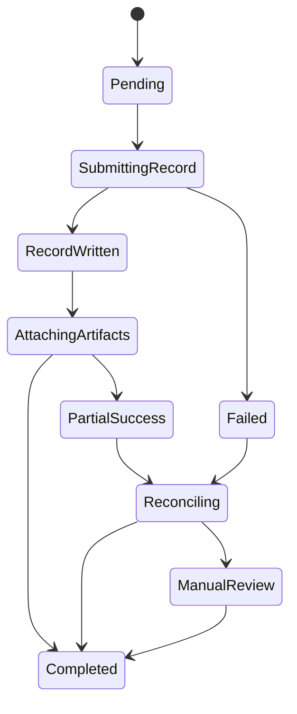

## TL;DR

- The hard part is not duplicate requests. The hard part is partial success.
- We had a workflow where the payment or invoice record could be written to the ERP, while required attachments failed to save.
- The fix was to stop calling the workflow "done" until every required artifact was verified, then add reconciliation for records that were partial, failed, or never came back clean.
- Rule of thumb: idempotency is not a retry button. It is a state model plus evidence plus a safe recovery path.

## On this page

- [Context](#context)
- [The Failure Mode](#the-failure-mode)
- [What Changed](#what-changed)
- [A State Model That Survives Partial Success](#a-state-model-that-survives-partial-success)
- [Reconciliation Is Part of the Product](#reconciliation-is-part-of-the-product)
- [What I Log to Prove What Happened](#what-i-log-to-prove-what-happened)
- [Tradeoffs](#tradeoffs)
- [Checklist](#checklist)
- [Wrap-up](#wrap-up)

## Context

People usually talk about idempotency as if the problem is simple: a request gets retried, so you make sure it only runs once.

That is part of it. It is not the part that hurts.

The pain shows up when an external workflow succeeds enough to matter, but not enough to be complete. You wrote the payment or invoice record. The provider or ERP accepted it. Then something else that was part of the same business action failed. In our case, the ugly version was attachments. The money side of the workflow had moved forward, but the supporting records were incomplete.

That is worse than a clean failure, because now you have two bad options. You can pretend it succeeded and leave the record incomplete, or you can retry blindly and risk creating a second side effect in a system you do not control.

## The Failure Mode

The simplified version looked like this:

1. We send a workflow to an external ERP.
2. The payment or invoice record is written successfully.
3. Required attachments fail to attach, or we never get a clean completion signal back.
4. Our system is left with an uncomfortable question: is this done, partially done, or safe to retry?

That is the kind of problem where "just retry it" stops being engineering and starts being gambling.

> **Failure mode:** the core record existed in the external system, but the full business action was incomplete because required attachments were missing.
>
> **Change we made:** we stopped marking the workflow complete until attachments were verified, and we added reconciliation code to detect and repair partial results safely.
>
> **New rule of thumb:** if a workflow has multiple external side effects, completion means all required side effects are verified, not just the first successful write.

The reason this gets tricky fast is that the external system usually does not hand you a clean idempotency contract for every step. Sometimes you have to build manual checks. Sometimes that means looking for existing records. Sometimes it means checking whether a binary-equivalent attachment is already there. Sometimes it means hashing. None of that is lightweight, but it is still better than creating duplicates or declaring success too early.

## What Changed

The first fix was semantic. We changed what "complete" meant.

Before, it was too easy for the workflow to treat the core record write as the finish line. Afterward, the workflow was only complete when the record existed and every required attachment had been confirmed.

That sounds obvious when you write it down. It is less obvious when the implementation grows over time and the first external success quietly becomes the de facto definition of done.

The second fix was reconciliation.

We needed code that could go back through records that failed outright, partially succeeded, or never came back with a trustworthy completion signal and ask:

- does the payment or invoice record exist
- is the external record complete
- which attachments are present
- which attachments are missing
- what is safe to write again

That last question is the whole game. Reconciliation is not a batch job that sprays retries everywhere. It is a controlled comparison between what should exist and what actually exists, followed by the smallest safe repair.

## A State Model That Survives Partial Success

If you want idempotency to hold up in a workflow like this, you need explicit states. A boolean `IsComplete` is not enough.

This is the rough shape I prefer:

What matters here is not the exact names. What matters is that `RecordWritten` is not the same thing as `Completed`, and `PartialSuccess` is a first-class state instead of an exception path nobody owns.

The workflow also needs a durable key that represents the business action, not just the HTTP request. If the key is "create this payment with these required artifacts," then every retry and every reconciliation step has something stable to reason about.

Without that, you end up asking the database and the ERP ad hoc questions in the middle of an incident, which is a bad time to invent your contract.

## Reconciliation Is Part of the Product

This is the part I think people underbuild.

If the workflow can partially succeed, reconciliation is not an admin script off to the side. It is part of the product surface, because it is the thing that tells you whether the external world and your internal world actually agree.

In practice, a useful reconciliation pass does three things:

1. It finds candidate records.

These are records that failed, timed out, or sat too long without reaching a terminal state.

2. It compares internal expectation to external reality.

Do we have the payment or invoice record? Do we have all required attachments? Which ones are missing?

3. It performs the smallest safe action.

If the record exists and one attachment is missing, add the missing attachment. If the external state is ambiguous, stop and route it for review. If the record does not exist at all, move it back into a state that can be retried safely.

That is also where the "manual idempotency" work shows up. If the external system does not give you a native idempotency key for attachments, then you have to approximate one. That might mean binary comparison. It might mean hashes. It might mean matching on stable metadata. The point is to avoid creating duplicate artifacts while still being able to repair the workflow.

This is one of those places where perfect elegance usually loses to clear evidence and boring repair logic.

## What I Log to Prove What Happened

When a workflow touches money and outside systems, logs are not for curiosity. They are evidence.

At minimum, I want:

- an internal workflow ID
- the business action key or idempotency key
- the external record identifier, once it exists
- the current state and previous state
- which attachments were expected
- which attachments were confirmed written
- which attachments were still missing
- the reason a retry or reconciliation step was allowed

If a human has to step in, they should be able to answer three questions quickly:

1. Did the core external record get created?
2. Is the workflow actually complete?
3. What is safe to do next?

If your logs cannot answer those questions, the recovery path is not really designed yet.

## Tradeoffs

This pattern costs real complexity.

- Reconciliation code is more work than a naive retry loop.
- Manual idempotency checks for attachments can be awkward and slow.
- Explicit states mean more modeling and more operational reporting.
- Sometimes the correct answer is manual review, which nobody enjoys.

I still prefer this shape because the alternative is hidden partial success. That is how you get a system that looks fine until someone has to prove what happened.

There is also a scale tradeoff here. If this failure mode is rare, you probably do not need an elaborate framework. You still need clear states and safe repair logic. You do not need a cathedral.

## Checklist

- [ ] Define the business action key, not just the request ID.
- [ ] Separate `RecordWritten` from `Completed`.
- [ ] Treat partial success as a real state, not a weird exception.
- [ ] Do not mark the workflow complete until every required side effect is verified.
- [ ] Add reconciliation for failed, partial, and stale in-progress records.
- [ ] Make reconciliation perform the smallest safe repair.
- [ ] Log enough evidence to prove what happened without guesswork.
- [ ] If the external system lacks native idempotency support, define the manual equivalence check up front.

## Wrap-up

Retries are cheap. Certainty is not.

If you only remember one thing: when a workflow has multiple external side effects, idempotency depends on how you model completion and how you recover from partial success. The retry policy matters, but the reconciliation path is what keeps you honest.

## Assets needed

- None.

## Open questions / assumptions

- Whether the post should say "invoice," "payment," or "payment application" as the main noun.
- Whether the attachment-equivalence check used hashing, metadata matching, binary comparison, or a mix.
- Whether reconciliation ran on a schedule, on demand, or both.

## Fact check list

- Confirm the exact business noun to use for the external record.
- Confirm whether the repair path ever re-created the base record, or only repaired attachments once the record existed.
- Confirm whether the external system returned a separate attachment identifier that helped de-duplication.
