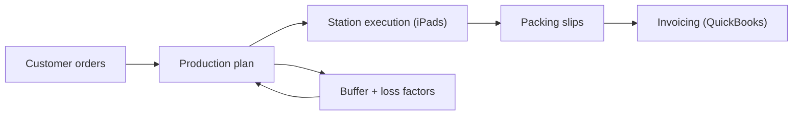

## TL;DR

- I built a small custom ERP/MRP system for Pearl Bakery instead of forcing our workflow into a legacy ERP or a growing Excel mess.
- The constraint was time. Daily planning and paper checklists were turning into a single-person bottleneck as we scaled.
- At our peak we were producing around 1,000 units/day across roughly 20 SKUs, with a team of 20+ people (peaking around 25).
- Rule of thumb: if the business depends on one person doing manual math every day, you do not have a planning process, you have a risk.

## On this page

- [TL;DR](#tldr)
- [On this page](#on-this-page)
- [Context](#context)
- [Decision](#decision)
- [Diagram](#diagram)
- [Implementation](#implementation)
  - [Phase 1: make the quantities computable](#phase-1-make-the-quantities-computable)
  - [Phase 2: put the plan where the work happens](#phase-2-put-the-plan-where-the-work-happens)
  - [Phase 3: close the loop (packing, then QuickBooks)](#phase-3-close-the-loop-packing-then-quickbooks)
  - [Implementation note: boring web tech, locked down access](#implementation-note-boring-web-tech-locked-down-access)
- [What worked / What didn't](#what-worked--what-didnt)
  - [What worked](#what-worked)
  - [What didn't](#what-didnt)
- [Tradeoffs](#tradeoffs)
- [How to use](#how-to-use)
- [Wrap-up](#wrap-up)
- [Checklist](#checklist)

## Context

Pearl Bakery was a wholesale bakery. We ran it for about three years and sold it.

If you have never run a production day, it is hard to explain how early you can get behind. In a bakery, "5am" is not a metaphor. It is a real time on the clock when people are ready to work and the first mixes need to happen, and you do not get a quiet hour to think.

I had nights where a delivery driver called out and I would show up around 11pm, do an eight-hour delivery run, and then come straight back to the bakery to start mixing. On days like that, you are not looking for "better process" in the abstract. You are looking for anything you can take off your plate that will not blow up later.

At the start, a lot of our business ran on Excel. Customer orders went in, I would do the math, and we printed paper sheets for the day. It was tedious, but it worked well enough while the volume was low.

The forcing function was time. As we grew, planning became a daily tax on me. It was not a one-time effort. It was every day. And it was fragile. If I was the only person who could reliably produce the plan, the business had a single point of failure.

At our peak we were producing around 1,000 units per day across roughly 20 SKUs, with a team of 20+ people (peaking around 25). That is not "I will just do the spreadsheet real quick" scale. The spreadsheet becomes a job.

I also did not want to cram our workflow into an old ERP that did not match how a real production floor runs. If the system fights the process, the process will win. People will route around it.

## Decision

The constraint was the workflow, so I started by mapping the workflow.

I broke the day into the parts that actually mattered:

- what orders exist
- what products we can make
- what the recipes are (and how they scale)
- what gets mixed first, what gets split later, and what gets shaped into finished goods
- what stations exist on the floor and what each station needs to do
- what needs to be packed for each customer
- how invoicing needs to reflect what actually shipped

Now I had to make it real.

I did not try to boil the ocean. I started with the biggest daily pain: figuring out the quantities we needed to produce each day. Then I expanded outward. Once I could trust the plan, I could put the plan on the floor. Once the plan and execution were in the same system, packing slips were a natural next step. Once packing was in the system, sending invoice line items to QuickBooks was the last manual step to kill.

That is what the ERP became: not a grand redesign, but an incremental removal of daily bottlenecks.

The goal was not a pretty dashboard. The goal was a boring, repeatable pipeline:

orders -> plan -> execution -> packing -> invoicing

## Diagram

Here is the system in one picture:

## Implementation

This is the part people get wrong when they hear "I built an ERP".

They imagine a database and a bunch of admin screens.

What I actually needed was a plan that could survive contact with the floor. And I needed it to run without my brain being the scheduler.

So I built the system around the day, not around the data.

### Phase 1: make the quantities computable

The first win was getting out of the daily math business. I needed a repeatable way to turn customer demand into quantities to produce, including the reality that bread production has loss and variability.

That meant I needed customers, products, and orders to live in a system of record instead of scattered spreadsheets. If the order data is wrong, the plan is wrong, so I treated order entry as part of the product.

The hard part was that production is not perfectly efficient. Dough gets left behind. Mistakes happen. Not every scrap gets used. So the planner included loss factors and buffers. That kept the plan resilient instead of brittle.

Recipes also do not scale cleanly unless you force them to. A recipe that works for a small batch needs to become something you can compute reliably at larger volumes.

On top of that, some products shared base mixes. That creates dependencies. Multiple finished products roll up into consolidated base batches.

So the output could not just be "make X loaves". It had to be "mix this much base, then split into these tubs, then allocate to these downstream products".

### Phase 2: put the plan where the work happens

Planning is only half the battle. The plan has to be executable.

We put iPads on tables around the bakery. Each station got a view that matched the work at that station.

Instead of "ERP screens", it was closer to work instructions:

- station-specific ingredient quantities
- step verification checkpoints
- temperature checks (water temp, dough temp, etc.)
- confirmations that a mix happened and was split

This was not about micromanaging people. It was about making the work easier to do correctly, and making the day easier to run.

### Phase 3: close the loop (packing, then QuickBooks)

Because customer orders were already part of the plan, the system could generate packing slips automatically.

At the end of the day we needed to answer practical questions:

- how much of each product goes to each customer
- how much is left over
- what was short (if anything)

Packing is where errors show up fast. The system made packing a first-class output of the plan, not an afterthought.

One of the worst kinds of work is the kind you do after the real work is done. Once packing and actual allocations live in the same system, invoicing can stop being a second round of re-typing. We integrated into QuickBooks so that shipped product could flow into weekly customer invoices.

If the work happened, the paperwork should not require a second round of manual effort.

### Implementation note: boring web tech, locked down access

The stack was intentionally simple. The app was ASP.NET Core with server-side rendered Razor Pages, hosted on Azure Web Apps, with an Azure SQL database behind it.

It also had to be locked down. This was not a public SaaS app. Access was primarily via an IP allow list because we had a static IP from our internet provider, and the iPads just opened a browser to the station page.

## What worked / What didn't

### What worked

End-to-end traceability was the biggest win. We could follow the thread from:

order -> plan -> station execution -> packing -> invoicing

The station UI mattered more than I expected. A system that lives on the floor has to feel like floor work, not admin work.

Buffers and loss factors were also non-negotiable. A perfect plan on paper is not a plan. A resilient plan is.

### What didn't

The first versions were not perfect. They never are.

If I turn this into a series, I will write down the early mistakes and how we corrected them. For now, the honest version is: you build the first version, you watch it get used, then you revise it.

One early mistake was batch sizing and buffer scaling. We would overproduce and throw away product, especially when buffer rules that made sense at small volumes scaled up linearly.

A 10% buffer on 10 items is 1 extra. A 10% buffer on 1,000 rolls is 100 extra, and now you are throwing away a lot of food.

We fixed that by tuning the planning rules so they respected real batch sizes and did not blindly scale buffers with volume. Underproducing still happened sometimes, but it was rarer. Overproducing was the bigger cost.

Another reality: software does not remove leadership. People still need training. Processes still need reinforcement. The system can make the right thing easier, but it cannot make the right thing inevitable.

## Tradeoffs

Building custom software for operations is a trade. You are not buying a tool. You are signing up to own a system.

- You own maintenance forever.
- You can overfit to your current workflow.
- You can create key-person risk if only one builder understands the system.

But there is a counterweight: forcing ops to bend around bad software is also a forever cost. It shows up as wasted time, workarounds, paper, and mistakes.

Both are valid. In our case, the bottleneck was daily planning and execution, so the software paid its rent.

## How to use

If you are building software for a physical operation, here is what I would do again.

Start with the workflow map, not the database schema. Figure out what has to happen, in what order, and where errors tend to appear.

Make the plan executable. Put it where the work happens. An office dashboard does not help at 5am.

Assume losses and buffers are part of the domain, not edge cases. If you pretend the world is perfect, the world will correct you.

Finally, automate the first thing that is both repetitive and business-critical. If one person doing manual math is the daily hinge pin, that is the place to start.

If you only remember one thing: make the plan something the team can run without you.

## Wrap-up

This was not a toy app. It was the operational backbone of a production business.

I like building systems like this because they are honest. If the system is wrong, the day is wrong. And if it is right, the work gets calmer.

## Checklist

This is the checklist I would use if I had to build this again, or if I was helping someone else build an operations system that needs to run at 5am.

- [ ] Map the workflow and stations first.
- [ ] Identify the daily bottleneck and the single points of failure.
- [ ] Model demand -> plan -> execution -> fulfillment.
- [ ] Add buffer and loss factors early.
- [ ] Put the UI where the work happens (stations, not dashboards).
- [ ] Generate packing outputs from the same data that generated the plan.
- [ ] Integrate invoicing so shipped product does not require re-typing.
- [ ] Add one operational feedback loop per month (watch usage, adjust rules, repeat).
